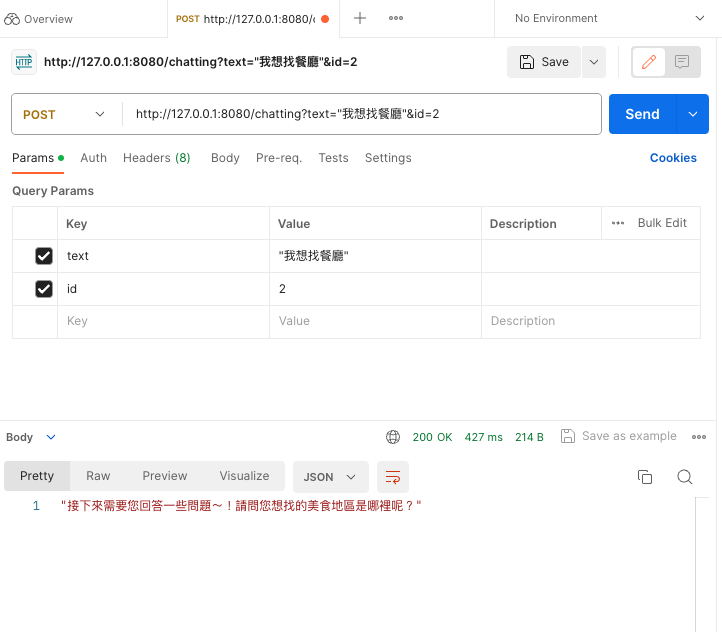

# **FastAPI** testing
+ use early testing AI model file that is not updated, but the flow completed
+ *++* in chatbot are removed for test in Postman
+ change to faiss-cpu and auto-gptq==0.3.0 for apple M1 testing


## Step for installation and operation
1. cd /testing_w_fastapi

2. Install fastAPI by enter the below command:
```
pip install "fastapi[all]"
```
(reference: https://fastapi.tiangolo.com/tutorial/)


3. Install requirements by enter the below command:
```
pip install -r requirements.txt
```


4. Set up the fastAPI server in local:
```
uvicorn mainai:app --host 127.0.0.1 --port 8080 --reload
```
or
```
uvicorn mainai:app --host 0.0.0.1 --port 8080 --reload
```
+ 127.0.0.1 and 0.0.0.1 are also okay for testing in local.
+ any port number are okay for testing in local.
+ On the server, if we want to call api internally ,please use 127.0.0.1.
+ '--reload' means the whole program would be reload automatically if any renew of the program file


5. After loaded, *Postman* can be used for testing (for example: --host 127.0.0.1 --port 8080) 
```
(Post) http://127.0.0.1:8080/chatting?text="我想找餐廳"&id=2
```
+ text : the message you want to ask AI
+ id : any integer 


6. communication with AI
+ Parameter "text" could be changed for communication with AI model.
+ Parameter "id" changed mean new member come to ask. 

### refernece demo capture
+ The model is loaded completely in FastAPI


+ Postman demo: after sending the message of example in step 5



